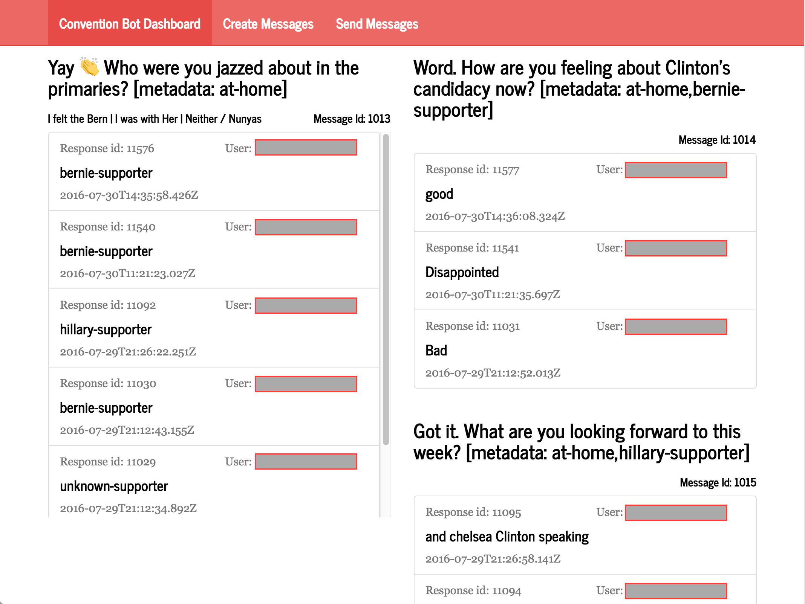
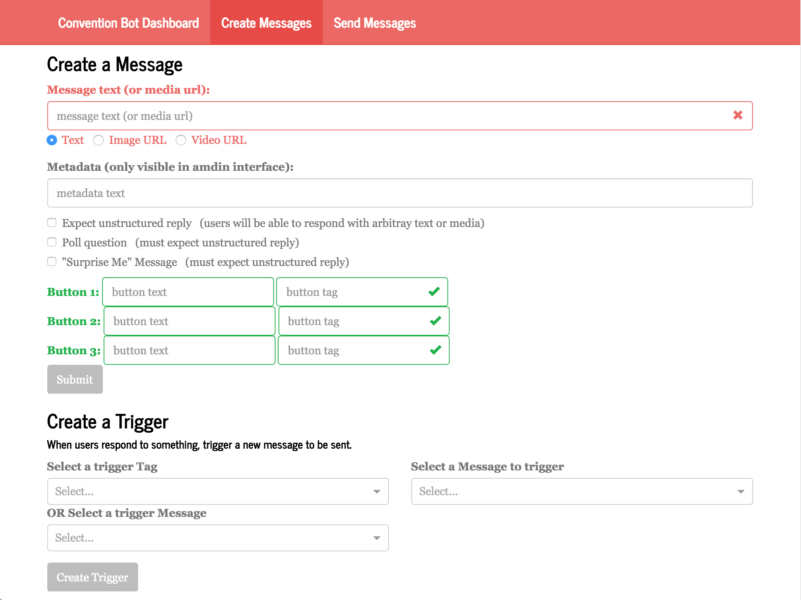
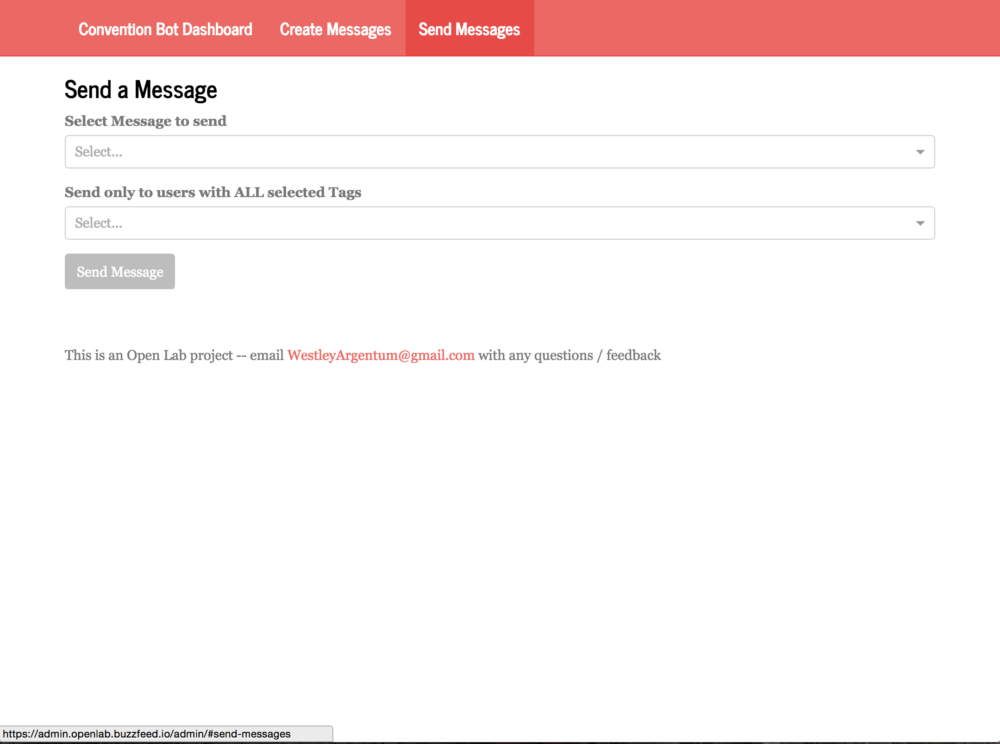

# BuzzBot

BuzzBot is an experiment, designed to help journalists connect with people on the ground at events. It acts as a Facebook Messenger bot plus a dashboard that journalists can use to send messages to groups of users and view aggregated responses.

## Facebook Messenger bot

The user facing side of BuzzBot is a Facebook Messenger bot that plugs into a Facebook Page. Users search for the page:

</img>

Or scan the page's Messenger Code:

</img>

And then start a conversation with BuzzBot by pressing "Get Started" or by sending a message:

</img>

BuzzBot will then message them back and start a conversation!

</img>

## Admin interface

The admin interface for BuzzBot is broken up into 3 sections: the dashboard, the interface for creating messages, and the interface for sending messages.

### Dashboard

</img>

The dashboard is where you can view all of the incoming responses from users. Lists of responses are grouped together and images + video content are rendered as you'd expect.

### Create Messages

</img>

The create message screen is where you can create messages to send out to users, and link messages together using triggers.

### Send Messages

</img>

The send message screen is where you can send out messages to groups of users who responded with specific tags.
