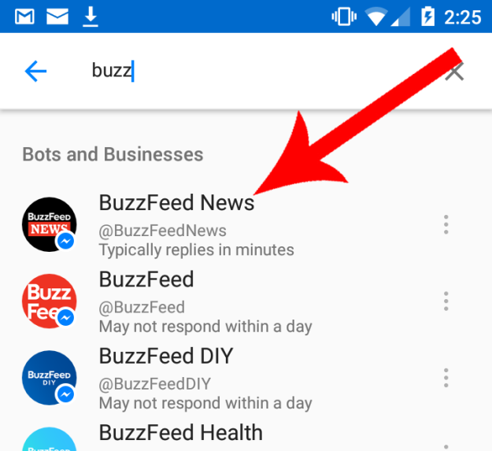
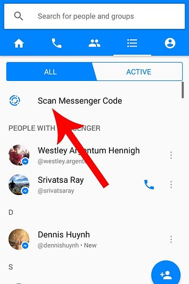
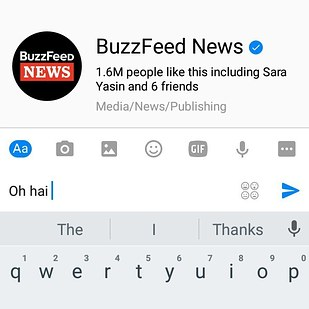

# BuzzBot

BuzzBot is an experiment, designed to help journalists connect with people on the ground at events. It acts as a Facebook Messenger bot plus a dashboard that journalists can use to send messages to groups of users and view aggregated responses.

### Facebook Messenger bot

The user facing side of BuzzBot is a Facebook Messenger bot that plugs into a Facebook Page. Users search for the page:

</img>

Or scan the page's Messenger Code:

</img>

And then start a conversation with BuzzBot by pressing "Get Started" or sending a message:

</img>

BuzzBot will then message them back and start a conversation!

</img>

### Admin interface
